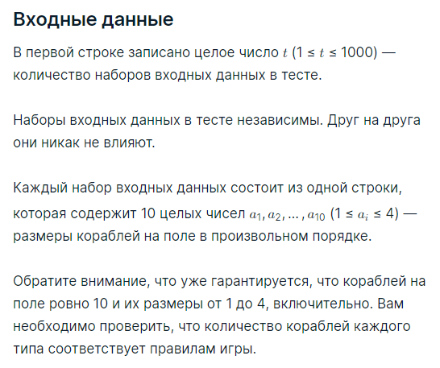
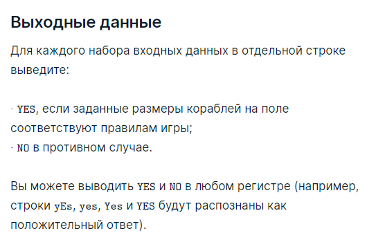

###Условие задачи

Это наиболее простая задача контеста. Надеемся, что вы познакомитесь с тестирующей системой Ozon Techpoint.

Правильные решения задач должны проходить все заранее заготовленные тесты жюри и укладываться в ограничения по времени/памяти на каждом тесте.

Ниже перечислены технические требования к решениям:
* решение читает входные данные со стандартного ввода (экрана);
* решение пишет выходные данные на стандартный вывод (экран);
* решение не взаимодействует как-либо с другими ресурсами компьютера (сеть, жесткий диск, процессы и прочее);
* решение использует только стандартную библиотеку языка;
* решение располагается в пакете по-умолчанию (или его аналоге для вашего языка), имеют стандартную точку входа для консольных программ;
* гарантируется, что во всех тестах выполняются все ограничения, что содержатся в условии задачи — как-либо проверять входные данные на корректность не надо, все тесты строго соответствуют описанному в задаче формату;
* выводи ответ в точности в том формате, как написано в условии задачи (не надо выводить <<поясняющих>> комментариев типа *введите число* или *ответ равен*);

Перейдём к задаче.

Вы участвуете в разработке подсистемы проверки поля для игры <<Морской бой>>. Вам требуется написать проверку корректности количества кораблей на поле, учитывая их размеры. Напомним, что на поле должны быть:
* четыре однопалубных корабля,
* три двухпалубных корабля,
* два трёхпалубных корабля,
* один четырёхпалубный корабль.

Вам заданы 10 целых чисел от 1 до 4. Проверьте, что заданные размеры соответствуют требованиям выше.

###Пример теста 1
__Входные данные__
5
2 1 3 1 2 3 1 1 4 2
1 1 1 2 2 2 3 3 3 4
1 1 1 1 2 2 2 3 3 4
4 3 3 2 2 2 1 1 1 1
4 4 4 4 4 4 4 4 4 4

__Выходные данные__
YES
NO
YES
YES
NO