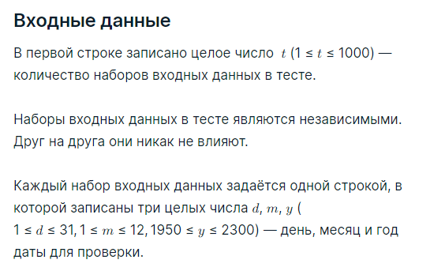
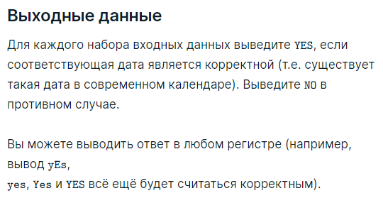

###Условие задачи

Задана дата в формате "день месяц год" в виде трёх целых чисел. Гарантируется, что:

* день — это целое число от 1 до 31;
* месяц — это целое число от 1 до 12;
* год — это целое число от 1950 до 2300.

Проверьте, что заданные три числа соответствуют корректной дате (в современном григорианском календаре).

Напоминаем, что в соответствии с современным календарём год считает високосным, если для этого года верно хотя бы одно из утверждений:

* делится на 4, но при этом не делится на 100;
* делится на 400.

Например, годы 2012 и 2000 являются високосными, но годы 1999, 2022 и 2100 - нет.

###Пример теста 1
__Входные данные__
10
10 9 2022
21 9 2022
29 2 2022
31 2 2022
29 2 2000
29 2 2100
31 11 1999
31 12 1999
29 2 2024
29 2 2023

__Выходные данные__
YES
YES
NO
NO
YES
NO
NO
YES
YES
NO