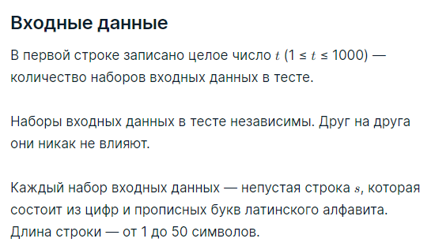
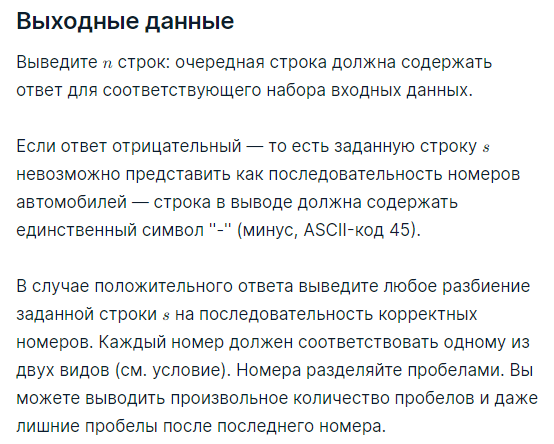

###Условие задачи

В Берляндии автомобильные номера состоят из цифр и прописных букв латинского алфавита. Они бывают двух видов:

* либо автомобильный номер имеет вид *буква−цифра−цифра−буква−буква* (примеры корректных номеров первого вида: R48FA, O00OO, A99OK);
* либо автомобильный номер имеет вид *буква−цифра−буква−буква* (примеры корректных номеров второго вида: T7RR, A9PQ, O0OO).

Таким образом, каждый автомобильный номер является строкой либо первого, либо второго вида.

Вам задана строка из цифр и прописных букв латинского алфавита. Можно ли разделить её пробелами на последовательность корректных автомобильных номеров? Иными словами, проверьте, что заданная строка может быть образована как последовательность корректных автомобильных номеров, которые записаны подряд без пробелов. В случае положительного ответа выведите любое такое разбиение.

###Пример теста 1
__Входные данные__
6
R48FAO00OOO0OOA99OKA99OK
R48FAO00OOO0OOA99OKA99O
A9PQ
A9PQA
A99AAA99AAA99AAA99AA
AP9QA

__Выходные данные__
R48FA O00OO O0OO A99OK A99OK
-
A9PQ
-
A99AA A99AA A99AA A99AA
-