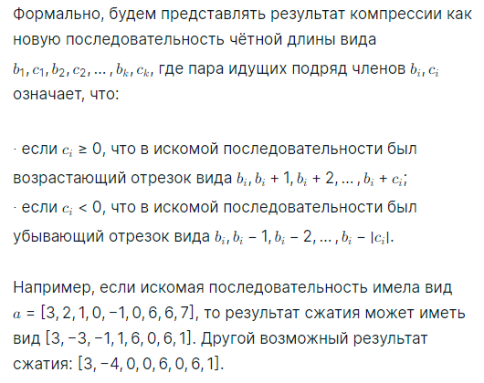
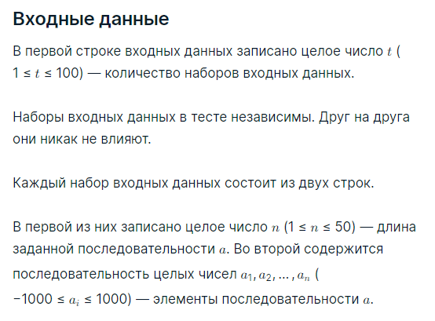
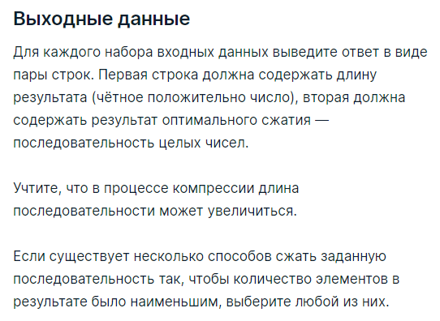

###Условие задачи

Компрессия данных (англ. data compression) — алгоритмическое (обычно обратимое) преобразование данных, производимое с целью уменьшения занимаемого ими объёма.

Вам предстоит реализовать простейший алгоритм компрессии последовательности чисел, который предполагает, что последовательность состоит из подряд идущих возрастающих или убывающих отрезков чисел.

По заданной последовательности __a__ выведите такой результат сжатия, который имеет наименьшую длину (последовательность-результат содержит минимальное количество элементов). Если такое сжатие неоднозначно, то выведите любое из них.

###Пример теста 1
__Входные данные__
5
9
3 2 1 0 -1 0 6 6 7
1
1000
7
1 2 3 4 5 6 7
7
1 3 5 7 9 11 13
11
100 101 102 103 19 20 21 22 42 41 40

__Выходные данные__
8
3 -4 0 0 6 0 6 1
2
1000 0
2
1 6
14
1 0 3 0 5 0 7 0 9 0 11 0 13 0
6
100 3 19 3 42 -2