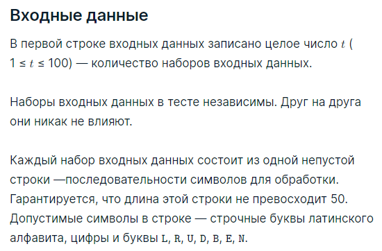
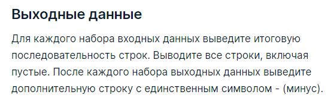

###Условие задачи

Реализуйте элемент функциональности простейшего терминала.

Изначально терминал содержит одну пустую строку, в начале которой находится курсор.

Ваша программа должна уметь обрабатывать последовательность символов (строку ввода). Обработка символа зависит от его значения:

* Строчная буква латинского алфавита или цифра обозначает, что соответствующий символ вставляется в положение курсора. Курсор сдвигается на позицию после вставленного символа.

* Буквы __L__ и __R__ обозначают нажатия стрелок влево и вправо. Они перемещают курсор на одну позицию влево или вправо. Если в соответствующем направлении нет символа, то операция
игнорируется. Заметьте, что курсор в любом случае
__остаётся__ в той же строке.

* Буквы __U__ и __D__ обозначают нажатия стрелок вверх и вниз. Они перемещают курсор на одну позицию вверх или вниз. Если в соответствующем направлении нет строки, то операция 
игнорируется. Если строка есть, но в ней нужная позиция не существует, то курсор встаёт в конец строки.

* Буквы __B__ и __E__ обозначают нажатия клавиш Home и End. Они перемещают курсор в начало или в конец текущей строки.

* Буква __N__ обозначает нажатие клавиши Enter — происходит вставка новой строки. Если курсор находился не в конце текущей строки, то она разрывается, и часть после курсора переносится в новую строку. Курсор после этой операции стоит в начале новой строки.

Вы можете представлять себе, что эмулируете последовательность нажатий в простейшем текстовом редакторе, в котором курсор занимает позицию между двумя символами строки (или находится в начале или конце строки).

Например, если строка ввода имеет вид *otLLLrRuEe256LLLN*, то в результате получится две строки:

* route
* 256

Промоделируйте последовательность действий и выведите результат.

###Пример теста 1
__Входные данные__
4
otLLLrRuEe256LLLN
LRLUUDE
itisatest
abNcdLLLeUfNxNx

__Выходные данные__
route
256
-

-
itisatest
-
af
x
xb
ecd
-