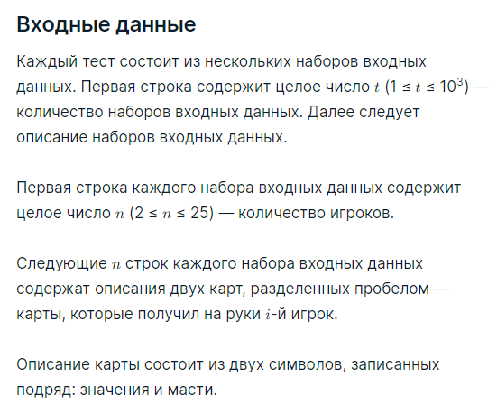
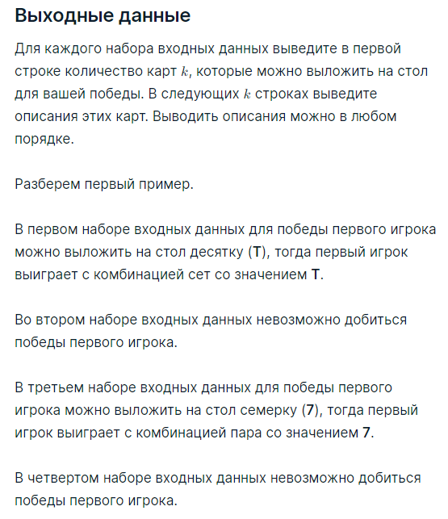

###Условие задачи

Колода состоит из 52 карт. Каждая карта обозначается одним из тринадцати значений (__2__, __3__, __4__, __5__, __6__, __7__, __8__, __9__, **T**en, **J**ack, **Q**ueen, **K**ing, **A**ce) и одной из четырех мастей (**S**pades, **C**lubs, **D**iamonds, **H**earts).

Выдуманная игра 3-Покер происходит следующим образом.

1. Изначально все n игроков получают по две карты из колоды.
2. После этого на стол выкладывается одна карта из той же колоды.
3. Выигрывают те игроки, у которых собралась самая старшая комбинация.

Для определения самой старшей комбинации, которая собралась у i-го игрока, используются следующие правила:

* если две карты у игрока в руке и карта на столе имеют одинаковое значение, игрок собрал комбинацию ‘Сет со значением x’;
* если из двух карт у игрока в руке и карты на столе можно выбрать две карты с одинаковым значением x, игрок собрал комбинацию ‘Пара со значением x’;
* иначе, берется карта с самым старшим значением из двух карт у игрока в руке и карты на столе, тогда игрок собрал комбинацию ‘Старшая карта x’.

Любой сет старше пары, а любая пара старше комбинации старшая карта. Из одинаковых комбинаций старше та, у которой старше значение. Если одинаковая самая старшая комбинация есть у нескольких игроков, все они объявляются выигрывшими.

Вы — первый игрок. Вам известно, какие карты получил на руки каждый игрок. Определите, какую карту можно выложить на стол, чтобы вы оказались в числе победителей.

###Пример теста 1
__Входные данные__
4
2
TS TC
AD AH
3
2H 3H
9S 9C
4D QS
3
4C 7H
4H 4D
6S 6H
3
2S 3H
2C 2D
3C 3D

__Выходные данные__
2
TD
TH
0
3
7S
7C
7D
0