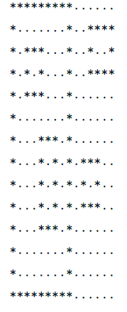
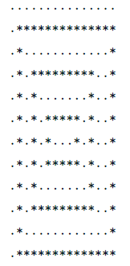
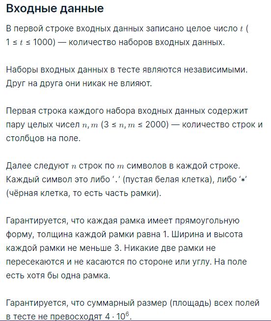

###Условие задачи

Игровое поле представляет собой белый прямоугольник n×m, на котором изображены черные прямоугольные рамки. Толщина каждой рамки равна 1, рамки не пересекаются и не касаются. Таким образом, для любых двух рамок a и b верно:

* либо a вложена в b,
* либо b вложена в a,
* либо a не вложена в b и одновременно b не вложена в a.

Пример возможного поля изображён ниже. Белые символы обозначены точками (‘.’), чёрные — звёздочками (‘*’).

Для каждой рамки найдите количество рамок, в которые она вложена. Выведите получившиеся r чисел в порядке неубывания, где r — количество рамок на поле.

Например, для поля выше результат имеет вид: 0,0,0,0,1,1,1,2 (четыре рамки не вложены в какие-либо другие, три рамки вложены в одну, одна рамка вложена в две).

###Пример теста 1
__Входные данные__
3
26 15
*********......
*.......*..****
*.***...*..*..*
*.*.*...*..****
*.***...*......
*.......*......
*...***.*......
*...*.*.*.***..
*...*.*.*.*.*..
*...*.*.*.***..
*...***.*......
*.......*......
*.......*......
*********......
...............
.**************
.*............*
.*.*********..*
.*.*.......*..*
.*.*.*****.*..*
.*.*.*...*.*..*
.*.*.*****.*..*
.*.*.......*..*
.*.*********..*
.*............*
.**************
15 15
***************
*.............*
*.***********.*
*.*.........*.*
*.*.*******.*.*
*.*.*.....*.*.*
*.*.*.***.*.*.*
*.*.*.*.*.*.*.*
*.*.*.***.*.*.*
*.*.*.....*.*.*
*.*.*******.*.*
*.*.........*.*
*.***********.*
*.............*
***************
3 4
***.
*.*.
***.

__Выходные данные__
0 0 0 0 1 1 1 2 
0 1 2 3 
0 