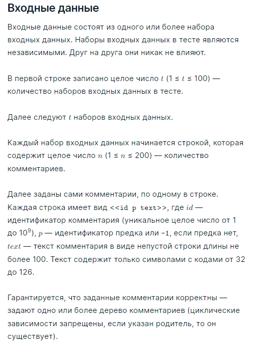
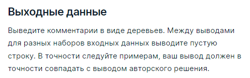

###Условие задачи

Вам задан набор комментариев. Каждый комментарий описывается тремя параметрами:

* своим идентификатором (уникальное целое число от 1 до 10^9),
* идентификатором предка (или -1, если предка нет),
* своим текстом (непустая строка из символов с кодами от 32 до 126 , включительно).

Выведите заданные комментарии в древесном виде, отформатировав их в точности так, как изображено в примерах.

Обратите внимание, что для каждого комментария-родителя его детей надо выводить в порядке увеличения их идентификаторов. Иными словами, всех детей одного родителя надо упорядочивать по возрастанию их идентификаторов.

Внимательно изучите примеры, точно следуйте всем особенностям форматирования (включая количество пробелов и т.п.). Вы можете выводить произвольное количество пробелов в конце строки. Например, при выводе <<| | |>> допустимо вывести <<| | | >>.

###Пример теста 1
__Входные данные__
4
14
75 22 I'm fine. Thank you.
84 82     Ciao!
26 22 So-so
45 26 What's wrong?
22 -1 How are you?
72 45 Maybe I got sick
81 72 I wish you a speedy recovery!
97 26   Stick it!
2 97 Thanks
47 72 I also got sick recently.
25 -1 Hi!
82 -1 Bye
17 82 Good day!
29 72 Visit the doctor
8
5 4 e
6 5 f
7 6 g
1 -1 a
2 1 b
3 2 c
4 3 d
8 7 h
6
10 -1 x
20 10 x
40 -1 x
50 -1 x
11 20 x
30 10 x
1
1000000000 -1 root

__Выходные данные__
How are you?
|
|--So-so
|  |
|  |--What's wrong?
|  |  |
|  |  |--Maybe I got sick
|  |     |
|  |     |--Visit the doctor
|  |     |
|  |     |--I also got sick recently.
|  |     |
|  |     |--I wish you a speedy recovery!
|  |
|  |--  Stick it!
|     |
|     |--Thanks
|
|--I'm fine. Thank you.

Hi!

Bye
|
|--Good day!
|
|--    Ciao!

a
|
|--b
   |
   |--c
      |
      |--d
         |
         |--e
            |
            |--f
               |
               |--g
                  |
                  |--h

x
|
|--x
|  |
|  |--x
|
|--x

x

x

root